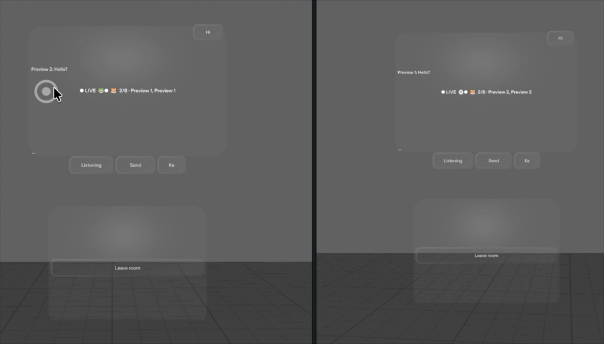

# TALKY

**CLAD Summer Hackathon · Week 3: Connect**  
Spatial hands-free chat for [SPECS] — speak, get a transcript, share it in a room.

*Dual-preview demo: two wearers in the same room, live presence (`2/8`), and the first shared “Hello?” message.*

---

## One-liner

Talky is a spatial chat experience for Specs: pick a 3-digit channel, speak hands-free, get a transcript, and share it with everyone in the same room — without taking out a phone.

---

## Why “Connect”?

Week 3 asks for a spatial experience that **connects people**, **platforms**, or **everyday communication workflows**.

Talky addresses all three:

- **People** — friends or strangers meet on the same channel code (e.g. `042`).
- **Workflow** — voice → transcription → send → read in the room, fully hands-free.
- **Platform** — built for Specs with CLAD in Lens Studio; sync via Connected Lens.

---

## Original vision: a walkie-talkie for Specs

The first idea was literal: a **walkie-talkie** for Specs — press to talk, hear friends live on the same frequency, like classic radio.

Intended stack:

- Push-to-talk microphone on Specs
- **Snap Cloud Realtime** to stream voice between wearers
- 3-digit channels to find the same “frequency”

**What blocked live voice:** live voice retransmission over Snap Cloud was not reliable enough for a polished demo in the time available. Rather than drop the “same channel, connect people” idea, the project pivoted.

---

## The pivot: from live voice to hands-free text chat

Talky keeps the **walkie-talkie metaphor** (shared channel, speak into the air) and changes the **payload**:

1. **Speak** — on-device ASR on Specs  
2. **Transcribe** — voice becomes text  
3. **Send** — message goes to the room  
4. **Read** — others on the same channel see it  

Why it still feels like a walkie-talkie:

- Same mental model: pick a channel, talk  
- Hands-free — no phone keyboard  
- Instant shared presence in a room  
- Readable history when you look at the floating UI  

---

## What Talky is today

A floating 3D Specs UI for **voice-to-text chat** in 3-digit rooms. (In the Lens the panel is branded **SPOKA**; the project / pitch name is **Talky**.)

### Core loop

- Dial the channel (▲ / ▼) → **GO** or **JOIN**
- **Speak** → ASR fills the draft
- **Send** → everyone in the room sees the message
- **Hide** → hide the full UI; an **incoming toast** still shows remote messages

### Use cases

- Friends at an event — same code on a poster  
- Specs wearers who want hands-free chat  
- Ice-breaker rooms (open channels for strangers)  
- Accessibility — speak instead of typing in AR  

---

## How messages travel

For the current demo, messages sync over **Connected Lens** (`MultiplayerSession` / `sendMessage`) — the same session used for dual-preview or shared Specs sessions.

**Snap Cloud** remains in the architecture for a future live-voice / cloud-room path, but the working chat demo uses the **Connected Lens transport**.

Physical colocation is **not** required for chat sync — users need a **shared Connected Lens session** and the **same channel code**. Same-room AR anchoring is a different problem; this experience is about shared communication, not colocated world content.

---

## Demo script (2–3 minutes)

1. **Setup** — Open dual Preview (or two Specs). Same channel, e.g. `042`. Tap **GO** on both.  
2. **Speak** — Tap **Speak** → short sentence → transcript → **Send**.  
3. **Connect** — Show the message on the other preview. Reply from Preview 2.  
4. **Hidden UI** — **Hide** → send from the other side → toast popup appears → **Open**.  
5. **Close** — “Same channel, hands-free chat — connection without a phone.”

---

## Judging criteria map

| Criterion | Weight | How Talky fits |
|---|---|---|
| **CLAD Execution** | 50% | Iterated with CLAD in Lens Studio: UIKit panels, ASR wiring, Connected Lens bridge, LEAF scenarios, layout/toast fixes through AI co-development loops. |
| **User Experience** | 25% | Clear channel dial, Speak / Send / Keys, hide + toast for remote messages, floating head-locked UI for Specs FOV. |
| **Creativity & Usefulness** | 25% | Honest pivot from walkie audio to voice→text rooms — still useful spatial communication, focused on meeting and talking without phones. |

---

**Talky** — Same channel. Hands free. Meet people through Specs.

*CLAD Summer Hackathon · Week 3: Connect · 
